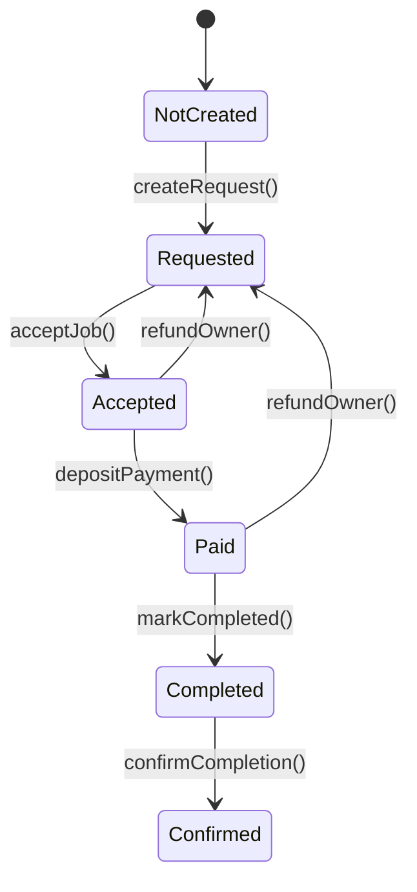
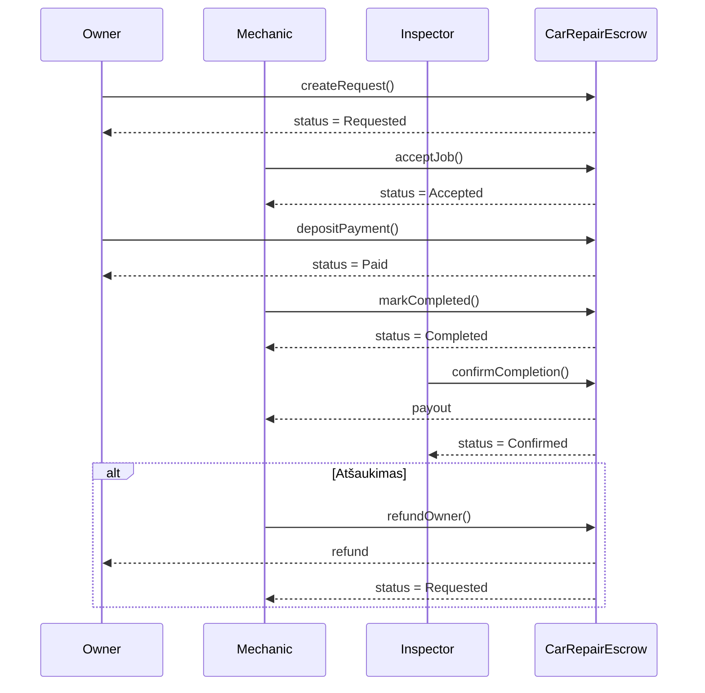

# Išmaniosios sutarties decentralizuota aplikacija pasiremiant autoremonto escrow modeliu

Decentralizuota aplikacija (DApp), realizuojanti automobilio remonto escrow modelį Ethereum Sepolia tinkle.

Projektą sudaro:
- Išmanioji sutartis (CarRepairEscrow.sol)
- Front-end (HTML + CSS + JavaScript + Ethers.js)
- Integracija su MetaMask

Tikslas – užtikrinti saugų trijų šalių bendradarbiavimą (Owner, Mechanic, Inspector), kai mokėjimas laikomas išmaniojoje sutartyje ir išmokamas tik patvirtinus darbų atlikimą.

---

## Verslo modelis

### Dalyviai

**Owner (automobilio savininkas)**  
- Kuria remonto užklausą  
- Perveda mokėjimą į escrow  

**Mechanic (mechanikas / servisas)**  
- Priima darbą  
- Pažymi, kad darbas baigtas  
- Gali grąžinti lėšas savininkui (refund)  

**Inspector (inspektorius)**  
- Patvirtina, kad remontas atliktas  
- Inicijuoja lėšų išmokėjimą mechanikui  

---

## Tipinis scenarijus

1. Owner sukuria remonto užklausą  
2. Mechanic priima darbą  
3. Owner perveda mokėjimą į escrow  
4. Mechanic pažymi, kad darbas atliktas  
5. Inspector patvirtina atlikimą  
6. Mechanic gauna lėšas  

Papildoma šaka: Mechanic gali grąžinti lėšas Owner’iui (`refundOwner()`), jei darbas atšaukiamas.

---

## Išmanioji sutartis

### Būsenos (Status enum)

- NotCreated  
- Requested  
- Accepted  
- Paid  
- Completed  
- Confirmed  

### Funkcijos

- createRequest(price, description, inspector)  
- acceptJob()  
- depositPayment()  
- markCompleted()  
- confirmCompletion()  
- refundOwner()  

---

## Būsenų diagrama



---

## Sekų diagrama



---

## Front-end (DApp)

Front-end aplikacija leidžia vartotojui sąveikauti su išmaniąja sutartimi per MetaMask ir Ethers.js.

### Funkcionalumas

- MetaMask prisijungimas  
- Automatinis tinklo patikrinimas (reikalauja Sepolia)  
- Vartotojo rolės nustatymas (Owner / Mechanic / Inspector)  
- Dinaminis mygtukų aktyvavimas pagal rolę ir būseną  
- Dabartinės sutarties būsenos rodymas  
- Būsenų stepper vizualizacija  
- Transakcijų log’ai su nuorodomis į Etherscan  

---

## Paleidimas lokaliai

### 1. Įrašyti kontrakto adresą ir ABI į `app.js`

```javascript
const CONTRACT_ADDRESS = "0x...";  
const CONTRACT_ABI = [ /* ABI JSON */ ];
```

### 2. Paleisti lokalų serverį

```bash
python3 -m http.server 8000
```

Tada naršyklėje atidaryti:  
http://localhost:8000

---

## Testavimo scenarijai

### Owner testai
- createRequest – sukuria užklausą  
- depositPayment – perveda ETH į escrow  

### Mechanic testai
- acceptJob – priima darbą  
- markCompleted – pažymi atlikimą  
- refundOwner – grąžina ETH savininkui  

### Inspector testai
- confirmCompletion – patvirtina ir išmoka lėšas  

---

## Etherscan log'ai

Kai kontraktas bus deploy’intas į Sepolia tinklą, transakcijų log'us galima tikrinti čia:

https://sepolia.etherscan.io/tx/<hash>

Rodoma:
- įvykdytos funkcijos  
- event'ai  
- transakcijos siuntėjas  
- "gas" sunaudojimas  
- grąžinti ar išmokėti ETH  

---

## Ekrano nuotraukos
Testavimas Remix <br />
 <br />
Įrankiai <br />
 <br />
Ganache account dashboard <br />
 <br />
truffle-config.js <br />
 <br />
Local contract deployment <br />
 <br />
Ganache deployed contract view <br />
 <br />
Sepolia testnet config in metamask <br />
 <br />
Token issue in Sepolia faucet <br />
 <br />
Token issue in Sepolia faucet <br />
 <br />
Polygon Amoy testnet config in metamask <br />
 <br />
Recieved POL from faucet <br />
 <br />
Truffle dashboard (after initiating deployment) <br />
 <br />
Confirmation of deployment inside dashboard (metamask popup) <br />
 <br />
Our deployed contract on Amoy testnet explorer
 <br />
Testing deployed contract on amoy issue (tsg neuztenka tokens kiek duoda)
 <br />

Trumpai apibendrinant: Kontraktui sukurti naudotas Remix IDE, is pradziu testuojama per pati Remix naudojant ju VM, veliau per Truffle ir Ganache lokaliai. Tada bandziau paleisti i testnet (Sepolia), bet dėl pasikeitusios tvarkos neįmanoma gauti token'ų iš faucetų (reikalauja turėti kažkiek ETH wallete, į kurį norimą siųsti). Galiausiai pasirinktas Polygon Amoy testnet. Deja, šis testnet nėra toks efektyvus taip Sepolia, nes labai greitai pasibaigia token'ai (vien deployment kontrakto sunaudoja beveik viską, lieka tik view funkcijoms). Kontraktas vis tiek buvo paleistas ir patestuotas, tačiau front-endui bus naudojamas lokalus tinklas dėl šio naujo apribojimo. Prie kiekvienos foto palieku komentarą, kuris žingsnis tai buvo, integruosi šitą į readme savo nuožiūra :)
## Išvada

Šis projektas demonstruoja, kaip išmanioji sutartis gali pakeisti tradicinį tarpininko vaidmenį realiame verslo scenarijuje. Automatinė escrow logika užtikrina:

- skaidrumą,  
- saugumą,  
- decentralizuotą sprendimų priėmimą,  
- aiškiai apibrėžtas roles,  
- patikimą lėšų laikymą iki užduoties įvykdymo.

DApp suteikia patogią vartotojo sąsają visam procesui išbandyti Ethereum Sepolia testiniame tinkle.
