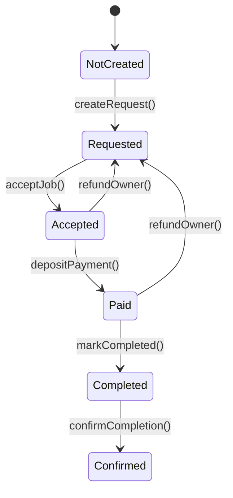
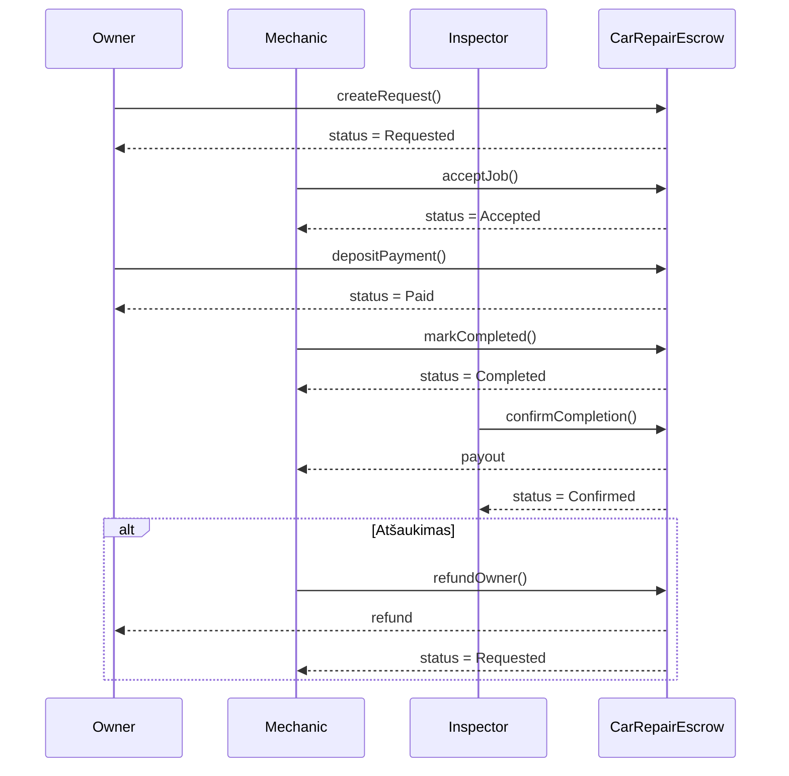

# Išmaniosios sutarties decentralizuota aplikacija pasiremiant autoremonto escrow modeliu

Decentralizuota aplikacija (DApp), realizuojanti automobilio remonto escrow modelį Ethereum Sepolia tinkle.

Projektą sudaro:
- Išmanioji sutartis (CarRepairEscrow.sol)
- Front-end (HTML + CSS + JavaScript + Ethers.js)
- Integracija su MetaMask

Tikslas – užtikrinti saugų trijų šalių bendradarbiavimą (Owner, Mechanic, Inspector), kai mokėjimas laikomas išmaniojoje sutartyje ir išmokamas tik patvirtinus darbų atlikimą.

---

## Verslo modelis

### Dalyviai

**Owner (automobilio savininkas)**  
- Kuria remonto užklausą  
- Perveda mokėjimą į escrow  

**Mechanic (mechanikas / servisas)**  
- Priima darbą  
- Pažymi, kad darbas baigtas  
- Gali grąžinti lėšas savininkui (refund)  

**Inspector (inspektorius)**  
- Patvirtina, kad remontas atliktas  
- Inicijuoja lėšų išmokėjimą mechanikui  

---

## Tipinis scenarijus

1. Owner sukuria remonto užklausą  
2. Mechanic priima darbą  
3. Owner perveda mokėjimą į escrow  
4. Mechanic pažymi, kad darbas atliktas  
5. Inspector patvirtina atlikimą  
6. Mechanic gauna lėšas  

Papildoma šaka: Mechanic gali grąžinti lėšas Owner’iui (`refundOwner()`), jei darbas atšaukiamas.

---

## Išmanioji sutartis

### Būsenos (Status enum)

- NotCreated  
- Requested  
- Accepted  
- Paid  
- Completed  
- Confirmed  

### Funkcijos

- createRequest(price, description, inspector)  
- acceptJob()  
- depositPayment()  
- markCompleted()  
- confirmCompletion()  
- refundOwner()  

---

## Būsenų diagrama



---

## Sekų diagrama



---

## Front-end (DApp)

Front-end aplikacija leidžia vartotojui sąveikauti su išmaniąja sutartimi per MetaMask ir Ethers.js.

### Funkcionalumas

- MetaMask prisijungimas  
- Automatinis tinklo patikrinimas (reikalauja Sepolia)  
- Vartotojo rolės nustatymas (Owner / Mechanic / Inspector)  
- Dinaminis mygtukų aktyvavimas pagal rolę ir būseną  
- Dabartinės sutarties būsenos rodymas  
- Būsenų stepper vizualizacija  
- Transakcijų log’ai su nuorodomis į Etherscan  

---

## Paleidimas lokaliai

### 1. Įrašyti kontrakto adresą ir ABI į `app.js`

```javascript
const CONTRACT_ADDRESS = "0x...";  
const CONTRACT_ABI = [ /* ABI JSON */ ];
```

### 2. Paleisti lokalų serverį

```bash
python3 -m http.server 8000
```

Tada naršyklėje atidaryti:  
http://localhost:8000

---

## Testavimo scenarijai

### Owner testai
- createRequest – sukuria užklausą  
- depositPayment – perveda ETH į escrow  

### Mechanic testai
- acceptJob – priima darbą  
- markCompleted – pažymi atlikimą  
- refundOwner – grąžina ETH savininkui  

### Inspector testai
- confirmCompletion – patvirtina ir išmoka lėšas  

---

## Etherscan log'ai

Kai kontraktas bus deploy’intas į Sepolia tinklą, transakcijų log'us galima tikrinti čia:

https://sepolia.etherscan.io/tx/<hash>

Rodoma:
- įvykdytos funkcijos  
- event'ai  
- transakcijos siuntėjas  
- "gas" sunaudojimas  
- grąžinti ar išmokėti ETH  

---

## Ekrano nuotraukos ir testavimo eiga

Šiame skyriuje pateikiamos pagrindinės projekto kūrimo, testavimo ir diegimo stadijos, iliustruojamos ekrano nuotraukomis. Jos atspindi visą išmaniosios sutarties kūrimo ciklą – nuo pirminio testavimo „Remix IDE“ aplinkoje iki bandymų diegti kontraktą į viešus testinius tinklus.

---

### Išmaniosios sutarties testavimas naudojant Remix IDE

Pirmasis etapas buvo išmaniosios sutarties kūrimas ir testavimas naudojant Remix IDE. Šioje aplinkoje sutartis buvo kompiliuojama ir testuojama naudojant „Remix VM“, leidžiant greitai patikrinti pagrindinę logiką, būsenų perėjimus ir funkcijų veikimą be išorinių priklausomybių.

Testavimo metu buvo:
- tikrinamos `createRequest`, `acceptJob`, `depositPayment` ir kitos funkcijos;
- stebimi būsenų (`status`) pasikeitimai;
- tikrinami `event` pranešimai.


---

### Naudojami įrankiai

Žemiau pateikiama ekrano nuotrauka su pagrindiniais projekto metu naudotais įrankiais:
- **Remix IDE** – išmaniosios sutarties kūrimui ir pirminiam testavimui;
- **Truffle** – kontrakto diegimui ir migracijoms;
- **Ganache** – lokalaus „Ethereum“ tinklo emuliacijai;
- **MetaMask** – piniginės ir transakcijų pasirašymo integracijai;
- **Ethers.js** – front-end sąsajai su išmaniąja sutartimi.


---

### Ganache paskyrų ir lokalaus tinklo peržiūra

Šiame etape buvo naudojamas Ganache įrankis, leidžiantis sukurti lokalų „Ethereum“ tinklą su iš anksto sugeneruotomis paskyromis ir ETH likučiais. Tai leido saugiai ir greitai testuoti kontraktą be realių lėšų naudojimo.

Ekrano nuotraukoje matomas:
- automatiškai sugeneruotų paskyrų sąrašas;
- jų ETH likučiai;
- tinklo parametrai (RPC URL, Chain ID).


---

### Truffle konfigūracija

Žemiau pateikiamas `truffle-config.js` failo vaizdas, kuriame aprašyta:
- lokalaus tinklo (`development`) konfigūracija;
- RPC adresas;
- naudojamas kompiliatoriaus („Solidity“) versijos nustatymas.

Šis failas buvo būtinas sėkmingam kontrakto diegimui naudojant „Truffle“.


---

### Išmaniosios sutarties diegimas lokaliame tinkle

Šiame etape kontraktas buvo sėkmingai deploy’intas į Ganache lokalų tinklą naudojant `truffle migrate`. Tai leido:
- patikrinti migracijų scenarijų veikimą;
- gauti realų kontrakto adresą;
- vėliau šį adresą naudoti front-end aplikacijoje.


---

### Deploy’into kontrakto peržiūra Ganache aplinkoje

Šioje ekrano nuotraukoje matomas jau sėkmingai deploy’intas kontraktas Ganache sąsajoje, su:
- kontrakto adresu;
- transakcijų skaičiumi;
- būsena „Deployed“.


---

### Bandymas naudoti Sepolia testnet

Toliau buvo bandoma perkelti kontraktą į Ethereum Sepolia testnet, sukonfigūruojant šį tinklą MetaMask piniginėje.


Tačiau bandant gauti testinių ETH iš Sepolia faucet išryškėjo nauji apribojimai:
- faucet reikalauja, kad piniginė jau turėtų nedidelį kiekį ETH;
- tai apsunkina naujų projektų testavimą.


---

### Polygon Amoy testnet alternatyva

Dėl Sepolia tinklo apribojimų buvo pasirinktas **Polygon Amoy testnet** kaip alternatyva. Žemiau pateikiama MetaMask tinklo konfigūracija ir gautų testinių POL žetonų vaizdas.


---

### Kontrakto diegimas per Truffle Dashboard

Toliau pateikiamos ekrano nuotraukos, rodančios:
- Truffle Dashboard inicijavimą;
- diegimo transakcijos patvirtinimą per MetaMask;
- sėkmingai deploy’intą kontraktą Polygon Amoy testnet „block explorer’yje“.


---

### Testavimo metu aptikta problema

Galiausiai testavimo metu buvo susidurta su problema, kai testinių žetonų kiekis buvo nepakankamas pilnam kontrakto testavimui, nes vienas diegimas sunaudoja didžiąją dalį suteikiamų resursų.


---

### Testavimo apibendrinimas

Apibendrinant galima teigti, kad:
- išmanioji sutartis sėkmingai sukurta ir ištestuota lokaliai;
- viešų testnet tinklų (Sepolia, Polygon Amoy) naudojimas susidūrė su praktiniais apribojimais;
Dėl šių priežasčių front-end aplikacijos demonstracijai ir testavimui pasirinktas lokalus Ganache tinklas, kuris užtikrina stabilų ir pilną funkcionalumą be papildomų kaštų ar apribojimų.

### DApp veikimo demonstracija    


Decentralizuota aplikacija (DApp) šiame projekte veikia kaip naudotojo sąsaja, leidžianti
verslo modelio dalyviams (Owner, Mechanic, Inspector) sąveikauti su išmaniąja sutartimi
be tiesioginio darbo su blockchain įrankiais. Visa pagrindinė verslo logika,
būsenų valdymas ir mokėjimų kontrolė yra realizuoti išmaniojoje sutartyje,
o front-end dalis veikia tik kaip tarpinė sąsaja tarp naudotojo ir blockchain tinklo.
Mūsų aplikacija taip pat turi log'ą, integruotą į sąsają, kad būtų lengva identifikuot pasitaikiusias klaidas.


## Galutinės išvados

Šis projektas demonstruoja, kaip išmanioji sutartis gali pakeisti tradicinį tarpininko vaidmenį realiame verslo scenarijuje. Automatinė escrow logika užtikrina:

- skaidrumą,  
- saugumą,  
- decentralizuotą sprendimų priėmimą,  
- aiškiai apibrėžtas roles,  
- patikimą lėšų laikymą iki užduoties įvykdymo.

DApp suteikia patogią vartotojo sąsają visam procesui išbandyti Ethereum Sepolia testiniame tinkle.
