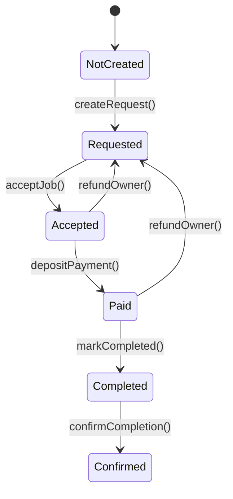
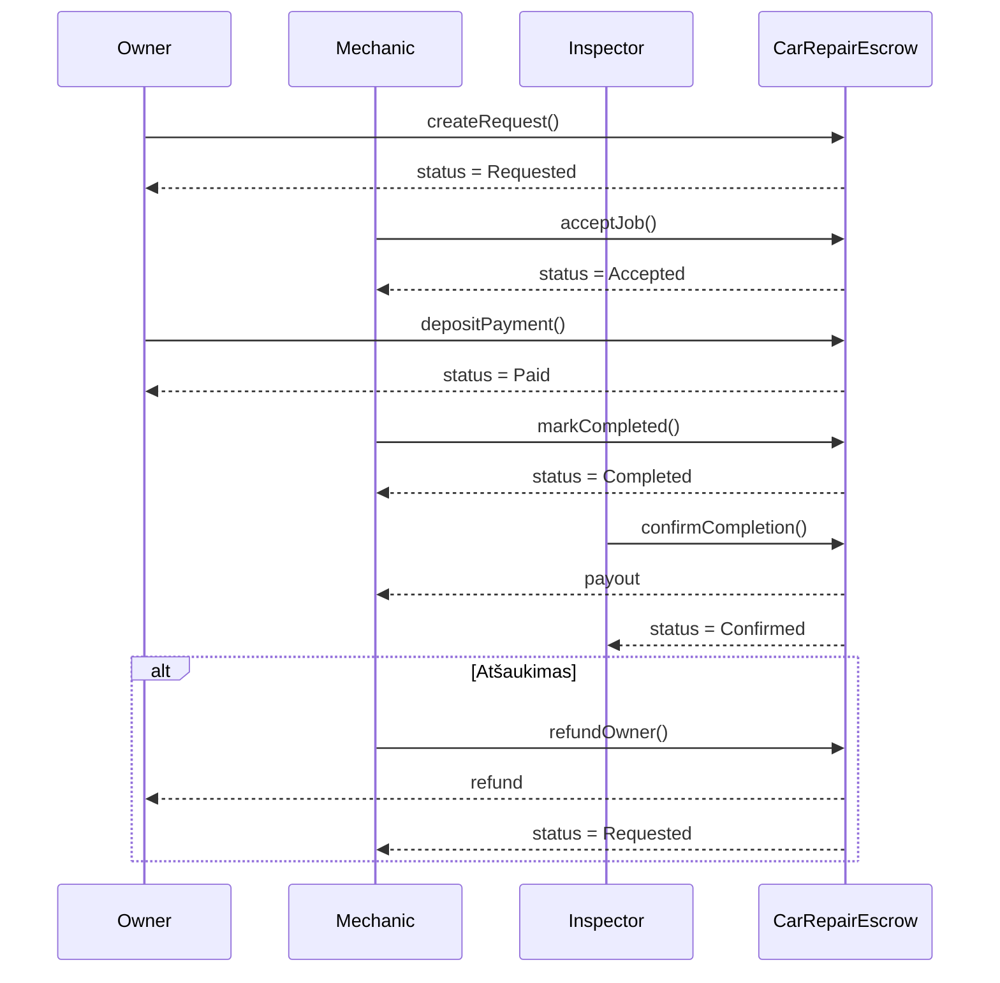

# Išmaniosios sutarties decentralizuota aplikacija pasiremiant autoremonto escrow modeliu

Decentralizuota aplikacija (DApp), realizuojanti automobilio remonto escrow modelį Ethereum Sepolia tinkle.

Projektą sudaro:
- Išmanioji sutartis (CarRepairEscrow.sol)
- Front-end (HTML + CSS + JavaScript + Ethers.js)
- Integracija su MetaMask

Tikslas – užtikrinti saugų trijų šalių bendradarbiavimą (Owner, Mechanic, Inspector), kai mokėjimas laikomas išmaniojoje sutartyje ir išmokamas tik patvirtinus darbų atlikimą.

---

## Verslo modelis

### Dalyviai

**Owner (automobilio savininkas)**  
- Kuria remonto užklausą  
- Perveda mokėjimą į escrow  

**Mechanic (mechanikas / servisas)**  
- Priima darbą  
- Pažymi, kad darbas baigtas  
- Gali grąžinti lėšas savininkui (refund)  

**Inspector (inspektorius)**  
- Patvirtina, kad remontas atliktas  
- Inicijuoja lėšų išmokėjimą mechanikui  

---

## Tipinis scenarijus

1. Owner sukuria remonto užklausą  
2. Mechanic priima darbą  
3. Owner perveda mokėjimą į escrow  
4. Mechanic pažymi, kad darbas atliktas  
5. Inspector patvirtina atlikimą  
6. Mechanic gauna lėšas  

Papildoma šaka: Mechanic gali grąžinti lėšas Owner’iui (`refundOwner()`), jei darbas atšaukiamas.

---

## Išmanioji sutartis

### Būsenos (Status enum)

- NotCreated  
- Requested  
- Accepted  
- Paid  
- Completed  
- Confirmed  

### Funkcijos

- createRequest(price, description, inspector)  
- acceptJob()  
- depositPayment()  
- markCompleted()  
- confirmCompletion()  
- refundOwner()  

---

## Būsenų diagrama



---

## Sekų diagrama



---

## Front-end (DApp)

Front-end aplikacija leidžia vartotojui sąveikauti su išmaniąja sutartimi per MetaMask ir Ethers.js.

### Funkcionalumas

- MetaMask prisijungimas  
- Automatinis tinklo patikrinimas (reikalauja Sepolia)  
- Vartotojo rolės nustatymas (Owner / Mechanic / Inspector)  
- Dinaminis mygtukų aktyvavimas pagal rolę ir būseną  
- Dabartinės sutarties būsenos rodymas  
- Būsenų stepper vizualizacija  
- Transakcijų log’ai su nuorodomis į Etherscan  

---

## Paleidimas lokaliai

### 1. Įrašyti kontrakto adresą ir ABI į `app.js`

```javascript
const CONTRACT_ADDRESS = "0x...";  
const CONTRACT_ABI = [ /* ABI JSON */ ];
```

### 2. Paleisti lokalų serverį

```bash
python3 -m http.server 8000
```

Tada naršyklėje atidaryti:  
http://localhost:8000

---

## Testavimo scenarijai

### Owner testai
- createRequest – sukuria užklausą  
- depositPayment – perveda ETH į escrow  

### Mechanic testai
- acceptJob – priima darbą  
- markCompleted – pažymi atlikimą  
- refundOwner – grąžina ETH savininkui  

### Inspector testai
- confirmCompletion – patvirtina ir išmoka lėšas  

---

## Etherscan log'ai

Kai kontraktas bus deploy’intas į Sepolia tinklą, transakcijų log'us galima tikrinti čia:

https://sepolia.etherscan.io/tx/<hash>

Rodoma:
- įvykdytos funkcijos  
- event'ai  
- transakcijos siuntėjas  
- "gas" sunaudojimas  
- grąžinti ar išmokėti ETH  

---

## Ekrano nuotraukos

NETURIM!

## Išvada

Šis projektas demonstruoja, kaip išmanioji sutartis gali pakeisti tradicinį tarpininko vaidmenį realiame verslo scenarijuje. Automatinė escrow logika užtikrina:

- skaidrumą,  
- saugumą,  
- decentralizuotą sprendimų priėmimą,  
- aiškiai apibrėžtas roles,  
- patikimą lėšų laikymą iki užduoties įvykdymo.

DApp suteikia patogią vartotojo sąsają visam procesui išbandyti Ethereum Sepolia testiniame tinkle.
